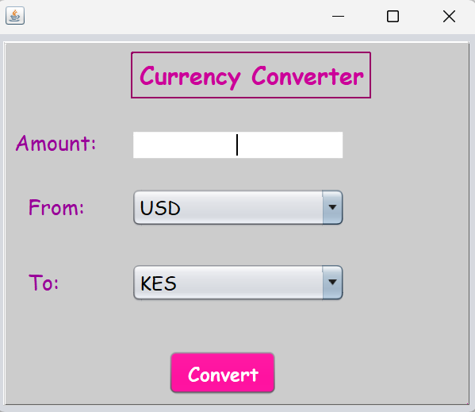

# 🌍 Currency Converter App 💸

Welcome to the **Currency Converter** app! This is a simple yet elegant tool designed to convert between multiple currencies and a target currency, with a focus on **ease of use** and **aesthetic design**. 🎨✨

## 💡 About the Project

This project is a **Java Swing-based** desktop application that helps you convert amounts between multiple currencies into a target currency. Currently, it supports the following currencies:

- **USD (United States Dollar)**
- **GBP (British Pound)**
- **EUR (Euro)**
- **KES (Kenyan Shilling)** – the target currency

### 🚀 Features:
- Input an amount in any supported currency (USD, GBP, EUR).
- Convert it to **KES** using pre-set conversion rates.
- Simple, user-friendly design with **center-aligned text fields** and **vibrant colors**.
- Enjoy a pleasant experience with **Comic Sans MS font** and a **light gray background** for a cute, functional UI! 💖

## 📸 Screenshots

Here’s a sneak peek at what the app looks like:

  


## 🛠️ Technologies Used

- **Java** (Swing for GUI)
- **NetBeans IDE** (for development)
- **Decimal Formatting** for easy-to-read currency amounts

## ⚙️ Setup Instructions

To get the **Currency Converter** running on your local machine:

1. **Clone the repository** to your local machine:
   ```bash
   git clone https://github.com/your-username/currency-converter.git

 ##  🛢️ Future Improvements
⌨️ Add keyboard support for better usability.

🎨 Improve button animations and hover effects.

✨ Implement memory functions (M+, M-, MR).

🔄 Add a history feature to track past calculations.

## 💌 Contributing
Feel free to fork this project and submit pull requests for improvements! 🚀

## 📅 License
This project is licensed under the MIT License.

Made with ❤️ by **Sheila Ngetich**.
